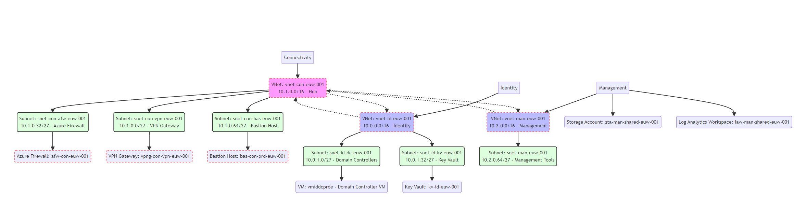

# My Lab




# Overview

```yaml
Contoso Azure Landing Zone Overview
├── Identity Subscription:
│   ├── VNet: vnet-id-euw-001 (10.0.0.0/16)
│   │   ├── Subnet: snet-id-dc-euw-001 (10.0.1.0/27) - Domain Controllers
│   │   │   └── VM: vmiddcprde - Domain Controller VM
│   │   ├── Subnet: snet-id-kv-euw-001 (10.0.1.32/27) - Key Vault
│   │   │   └── Key Vault: kv-id-euw-001
│   │   └── Peering: peer-id-to-con-euw-001 to Connectivity VNet
│
├── Connectivity Subscription:
│   ├── VNet: vnet-con-euw-001 (10.1.0.0/16)
│   │   ├── Subnet: snet-con-bas-euw-001 (10.1.0.64/27) - Bastion Host
│   │   │   └── Bastion Host: bas-con-prd-euw-001
│   │   ├── Subnet: snet-con-vpn-euw-001 (10.1.0.0/27) - VPN Gateway
│   │   │   └── VPN Gateway: vpng-con-vpn-euw-001
│   │   ├── Subnet: snet-con-afw-euw-001 (10.1.0.32/27) - Azure Firewall
│   │   │   └── Azure Firewall: afw-con-euw-001
│   │   └── Peerings:
│   │       ├── peer-con-to-man-euw-001 to Management VNet
│   │       ├── peer-con-to-id-euw-001 to Identity VNet
│   │       └── peer-con-to-wrk-euw-001 to Workload VNet (if applicable)
│
└── Management Subscription:
    ├── VNet: vnet-man-euw-001 (10.2.0.0/16)
    │   └── Subnet: snet-man-euw-001 (10.2.0.64/27) - Management Tools
    ├── Storage Account: sta-man-shared-euw-001
    └── Log Analytics Workspace: law-man-shared-euw-001

```

## Identity Subscription

## Resources to be created

| ResourceName            | Resource Group | Terraform Resource Type                | Location | Purpose                     |
| ----------------------- | -------------- | -------------------------------------- | -------- | --------------------------- |
| vnet-id-euw-001         | rg-id-prd-001  | azurerm_virtual_network                | weu      | identity vnet (10.0.0.0/16) |
| snet-id-dc-euw-001      | rg-id-prd-001  | azurerm_subnet                         | weu      | dc subnet (10.0.1.0/27)     |
| snet-id-kv-euw-001      | rg-id-prd-001  | azurerm_subnet                         | weu      | kv subnet (10.0.1.32/27)    |
| nic-id-dc-prd-euw-001   | rg-id-prd-001  | azurerm_network_interface              | weu      | nic for vm1 (dc)            |
| vmiddcprde              | rg-id-prd-001  | azurerm_windows_virtual_machine        | weu      | dc vm (dc)                  |
| kv-id-euw-001           | rg-id-prd-001  | azurerm_key_vault                      | weu      | keyvault for identity       |
| peer-id-to-con-euw-001  | rg-id-prd-001  | azurerm_virtual_network_peering        | weu      | peering to connectivity     |
| rt-id-euw-001           | rg-id-prd-001  | azurerm_route_table                    | weu      | main routing for identity   |
| rta-id-dc-euw-001       | rg-id-prd-001  | azurerm_subnet_route_table_association | weu      | route assoc for dc          |
| rta-id-kv-euw-001       | rg-id-prd-001  | azurerm_subnet_route_table_association | weu      | route assoc for kv          |

### Optional/Later use Resources
| ResourceName            | Resource Group | Terraform Resource Type                | Location | Purpose                     |
| ----------------------- | -------------- | -------------------------------------- | -------- | --------------------------- |
| nsg-id-dc-euw-001       | rg-id-prd-001  | azurerm_network_security_group         | weu      | nsg for dc subnet           |
| nsg-id-kv-euw-001       | rg-id-prd-001  | azurerm_network_security_group         | weu      | nsg for kv subnet           |
| azurerm_network_security_rule

### Questions
- What should be the nsg for the dc subnet ?
- What should be the nsg for the kv subnet ?

## Connectivity Subscription

## Resources to be created

| ResourceName            | Resource Group | Terraform Resource Type               | Location | Purpose                       |
| ----------------------- | -------------- | --------------------------------------| -------- | ----------------------------- |
| vnet-con-euw-001        | rg-con-prd-001 | azurerm_virtual_network               | weu      | conn vnet (10.1.0.0/16)       |
| snet-con-bas-euw-001    | rg-con-prd-001 | azurerm_subnet                        | weu      | bastian subnet (10.1.0.64/27) |
| snet-con-vpn-euw-001    | rg-con-prd-001 | azurerm_subnet                        | weu      | vpn subnet (10.1.0.0/27)      |
| snet-con-afw-euw-001    | rg-con-prd-001 | azurerm_subnet                        | weu      | afw subnet (10.1.0.32/27)     |
| afw-con-euw-001         | rg-con-prd-001 | azurerm_firewall                      | weu      | azure firewall                |
| vpng-con-vpn-euw-001    | rg-con-prd-001 | azurerm_virtual_network_gateway       | weu      | vpn gateway                   |
| bas-con-prd-euw-001     | rg-con-prd-001 | azurerm_bastion_host                  | weu      | bastion                       |
| nsg-con-bas-euw-001     | rg-con-prd-001 | azurerm_network_security_group        | weu      | nsg for bastian subnet        |
| nsg-con-afw-euw-001     | rg-con-prd-001 | azurerm_network_security_group        | weu      | nsg for firwall subnet        |
| nsg-con-vpn-euw-001     | rg-con-prd-001 | azurerm_network_security_group        | weu      | nsg for vpn subnet            |
| pip-con-bas-prd-euw-001 | rg-con-prd-001 | azurerm_public_ip                     | weu      | public ip for bastian         |
| pip-con-vpn-prd-euw-001 | rg-con-prd-001 | azurerm_public_ip                     | weu      | public ip for vpn             |
| pip-con-afw-prd-euw-001 | rg-con-prd-001 | azurerm_public_ip                     | weu      | public ip for afw             |
| peer-con-to-man-euw-001 | rg-con-prd-001 | azurerm_virtual_network_peering       | weu      | peering to management         |
| peer-con-to-id-euw-001  | rg-con-prd-001 | azurerm_virtual_network_peering       | weu      | peering to identity           |
| peer-con-to-wrk-euw-001 | rg-con-prd-001 | azurerm_virtual_network_peering       | weu      | peering to workoload          |


### Optional/Later use Resources

| ResourceName            | Resource Group | Terraform Resource Type                           | Location | Purpose                        |
| ----------------------- | -------------- | ------------------------------------------------- | -------- | ------------------------------ |
| rt-con-bas-euw-001      | rg-con-prd-001  | azurerm_route_table                               | weu      | routing for bastian           |
| rta-con-bas-euw-001     | rg-con-prd-001  | azurerm_subnet_route_table_association            | weu      | route assoc for bastian       |
| rt-con-vpn-euw-001      | rg-con-prd-001  | azurerm_route_table                               | weu      | main routing fo vpn           |
| rta-con-vpn-euw-001     | rg-con-prd-001  | azurerm_subnet_route_table_association            | weu      | route assoc for vpn           |


### Questions
- What should be the nsg for the bastian subnet ?
- What should be the routing for bastian ? 
- What should be the routing for the vpn ? 

## Management Subscription

| ResourceName              | Resource Group | Terraform Resource Type                           | Location | Purpose                       |
| ------------------------- | -------------- | ------------------------------------------------- | -------- | ----------------------------- |
| vnet-man-euw-001          | rg-man-prd-001 | azurerm_virtual_network                           | weu      | conn vnet (10.1.0.0/16)       |
| snet-man-euw-001          | rg-man-prd-001 | azurerm_subnet                                    | weu      | bastian subnet (10.1.0.64/27) |
| sta-man-shared-euw-001    | rg-man-prd-001 | storage account                                   | weu      | vpn subnet (10.1.0.0/27)      |
| law-man-shared-euw-001    | rg-man-prd-001 | log analtcis workspace                            | weu      | afw subnet (10.1.0.32/27)     |
| rt-man-euw-001            | rg-man-prd-001  | azurerm_route_table                              | weu      | main routing for identity     |
| rta-man-euw-001           | rg-man-prd-001  | azurerm_subnet_route_table_association           | weu      | route assoc for dc            |

### Optional/Later use Resources

| ResourceName            | Resource Group | Terraform Resource Type                           | Location | Purpose                        |
| ----------------------- | -------------- | ------------------------------------------------- | -------- | ------------------------------ |
| rt-con-bas-euw-001      | rg-man-prd-001  | azurerm_route_table                               | weu      | routing for bastian           |
| rta-con-bas-euw-001     | rg-man-prd-001  | azurerm_subnet_route_table_association            | weu      | route assoc for bastian       |
| rt-con-vpn-euw-001      | rg-man-prd-001  | azurerm_route_table                               | weu      | main routing fo vpn           |