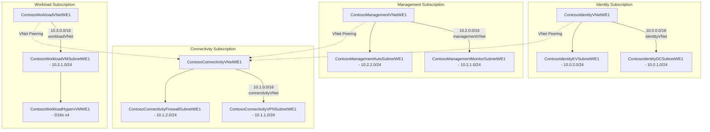

```mermaid
graph TD
    subgraph "Identity Subscription"
        identityVNet[ContosoIdentityVNetWE1] -- 10.0.0.0/16
        identityVNet --> identityDCSubnet[ContosoIdentityDCSubnetWE1 - 10.0.1.0/24]
        identityVNet --> identityKVSubnet[ContosoIdentityKVSubnetWE1 - 10.0.2.0/24]
    end

    subgraph "Connectivity Subscription"
        connectivityVNet[ContosoConnectivityVNetWE1] -- 10.1.0.0/16
        connectivityVNet --> connectivityVPNSubnet[ContosoConnectivityVPNSubnetWE1 - 10.1.1.0/24]
        connectivityVNet --> connectivityFirewallSubnet[ContosoConnectivityFirewallSubnetWE1 - 10.1.2.0/24]
    end

    subgraph "Management Subscription"
        managementVNet[ContosoManagementVNetWE1] -- 10.2.0.0/16
        managementVNet --> managementMonitorSubnet[ContosoManagementMonitorSubnetWE1 - 10.2.1.0/24]
        managementVNet --> managementAutoSubnet[ContosoManagementAutoSubnetWE1 - 10.2.2.0/24]
    end

    subgraph "Workload Subscription"
        workloadVNet[ContosoWorkloadVNetWE1] -- 10.3.0.0/16
        workloadVNet --> workloadVMSubnet[ContosoWorkloadVMSubnetWE1 - 10.3.1.0/24]
        workloadVMSubnet --> hypervVM[ContosoWorkloadHypervVMWE1 - D16s v4]
    end

    identityVNet -.-> |VNet Peering| connectivityVNet
    managementVNet -.-> |VNet Peering| connectivityVNet
    workloadVNet -.-> |VNet Peering| connectivityVNet

```